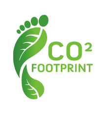

# Carbon Emission Analysis

This report aims to analyze carbon emissions to examine the carbon footprint across various industries. We aim to identify sectors with the highest levels of emissions by analyzing them across countries and years, as well as to uncover trends.

Carbon emissions play a crucial role in the environment, accounting for over 75% of global emissions and posing a significant environmental challenge. These emissions contribute to the accumulation of greenhouse gases in the atmosphere, leading to climate change, planetary warming, and involvement in various environmental disasters.

Through this analysis, we hope to gain an understanding of the environmental impact of different industries and contribute to making informed decisions in sustainable development.

## Data Source
Our dataset is compiled from publicly available data from nature.com and encompasses the product carbon footprints (PCF) for various companies. PCFs represent the greenhouse gas emissions associated with specific products, quantified in CO2 (carbon dioxide equivalent).

## Data Structure
The dataset consists of 4 tables containing information regarding carbon emissions generated during the production of goods.

## Carbon Emission Analysis
### Which products contribute the most to carbon emissions?
Get top 10 products contribute the most to carbon emissions

**SQL:**
`select product_name,
        sum(carbon_footprint_pcf) as CO2_emission
from product_emissions
group by product_name
order by sum(carbon_footprint_pcf) desc
limit 10
`

**Result:**
| product_name                                                                                                                       | CO2_emission | 
| ---------------------------------------------------------------------------------------------------------------------------------: | -----------: | 
| Wind Turbine G128 5 Megawats                                                                                                       | 3718044      | 
| Wind Turbine G132 5 Megawats                                                                                                       | 3276187      | 
| Wind Turbine G114 2 Megawats                                                                                                       | 1532608      | 
| Wind Turbine G90 2 Megawats                                                                                                        | 1251625      | 
| TCDE                                                                                                                               | 198150       | 
| Land Cruiser Prado. FJ Cruiser. Dyna trucks. Toyoace.IMV def unit.                                                                 | 191687       | 
| Retaining wall structure with a main wall (sheet pile): 136 tonnes of steel sheet piles and 4 tonnes of tierods per 100 meter wall | 167000       | 
| Electric Motor                                                                                                                     | 160655       | 
| Audi A6                                                                                                                            | 111282       | 
| Average of all GM vehicles produced and used in the 10 year life-cycle.                                                            | 100621       | 

**Insights:**
The data reveals that wind turbine production generates high CO2 emissions, with larger models like the G128 5MW (3.7 millions) and G132 5MW (3.2 millions) having the biggest footprint, though their long-term clean energy benefits outweigh initial emissions. Smaller turbines, like the G90 2MW (1.25 millions), produce significantly less. Traditional vehicles, such as the Land Cruiser Prado and Audi A6, contribute around 100,000 – 190,000 over their lifecycle, highlighting the environmental impact of fossil-fuel cars. Infrastructure projects, like retaining walls (167,000) and electric motors (160,655), also have substantial emissions, showing the need for greener construction and industrial solutions. The insights emphasize the importance of renewable energy adoption, low-emission transportation, and sustainable materials to reduce environmental impact.🌍

### What are the industry groups of these products?
These products belong to various industry groups, each of these industries plays a significant role in global carbon emissions.

**SQL:**
`select product_name,
	industry_group
from
  (
   select industry_group_id, product_name
   from product_emissions
   group by industry_group_id, product_name
   order by sum(carbon_footprint_pcf) desc
   limit 10
  ) top_10_CO2
  join industry_groups ig
  on top_10_CO2.industry_group_id = ig.id
`

**Result:**
| product_name                                                                                                                       | industry_group                     | 
| ---------------------------------------------------------------------------------------------------------------------------------: | ---------------------------------: | 
| Land Cruiser Prado. FJ Cruiser. Dyna trucks. Toyoace.IMV def unit.                                                                 | Automobiles & Components           | 
| Audi A6                                                                                                                            | Automobiles & Components           | 
| Average of all GM vehicles produced and used in the 10 year life-cycle.                                                            | Automobiles & Components           | 
| Electric Motor                                                                                                                     | Capital Goods                      | 
| Wind Turbine G128 5 Megawats                                                                                                       | Electrical Equipment and Machinery | 
| Wind Turbine G132 5 Megawats                                                                                                       | Electrical Equipment and Machinery | 
| Wind Turbine G114 2 Megawats                                                                                                       | Electrical Equipment and Machinery | 
| Wind Turbine G90 2 Megawats                                                                                                        | Electrical Equipment and Machinery | 
| TCDE                                                                                                                               | Materials                          | 
| Retaining wall structure with a main wall (sheet pile): 136 tonnes of steel sheet piles and 4 tonnes of tierods per 100 meter wall | Materials                          | 

**Insights:**
The top CO2-emitting products fall into four key industry groups: Electrical Equipment and Machinery, Automobiles & Components, Capital Goods, and Materials. Wind turbines produce the highest emissions during production, but they will have long-term clean energy benefits. Automobiles, including the Land Cruiser Prado, Audi A6, and GM vehicles, generate substantial emissions due to fuel consumption and production processes. Industrial equipment like electric motors and construction materials such as retaining wall structures also have significant carbon footprints, mainly from material extraction and heavy industrial processing.🌱

### What are the industries with the highest contribution to carbon emissions?
Get top 10 industry_groups contribute the most to carbon emissions

**SQL:**
`select industry_group, sum(carbon_footprint_pcf) as CO2_emission
from industry_groups ig
  join product_emissions pe
  on ig.id = pe.industry_group_id
group by industry_group
order by sum(carbon_footprint_pcf) desc
limit 10
`

**Result:**
| industry_group                                   | CO2_emission | 
| -----------------------------------------------: | -----------: | 
| Electrical Equipment and Machinery               | 9801558      | 
| Automobiles & Components                         | 2582264      | 
| Materials                                        | 577595       | 
| Technology Hardware & Equipment                  | 363776       | 
| Capital Goods                                    | 258712       | 
| "Food, Beverage & Tobacco"                       | 111131       | 
| "Pharmaceuticals, Biotechnology & Life Sciences" | 72486        | 
| Chemicals                                        | 62369        | 
| Software & Services                              | 46544        | 
| Media                                            | 23017        | 

**Insights:**
The industries with the highest CO2 emissions are Electrical Equipment and Machinery (9.8 millions), Automobiles & Components (2.58 millions), and Materials (577,595). The Electrical Equipment sector, driven by wind turbine production, has the largest footprint due to high material and manufacturing energy demands. The Automobile industry contributes significantly through vehicle production and fuel consumption, while Materials, including construction infrastructure, add further emissions from steel and concrete production. In contrast, industries like Technology Hardware, Pharmaceuticals, and Software have lower emissions, reflecting their less material-intensive production.🌍

### What are the companies with the highest contribution to carbon emissions?
Get top 5 companies contribute the most to carbon emissions

**SQL:**
`select company_name,
       sum(carbon_footprint_pcf) as CO2_emission
from companies c
  join product_emissions pe on c.id = pe.company_id
group by company_name
order by sum(carbon_footprint_pcf) desc
limit 5`

**Result:**
| company_name                            | CO2_emission | 
| --------------------------------------: | -----------: | 
| "Gamesa Corporación Tecnológica, S.A."  | 9778464      | 
| Daimler AG                              | 1594300      | 
| Volkswagen AG                           | 655960       | 
| "Mitsubishi Gas Chemical Company, Inc." | 212016       | 
| "Hino Motors, Ltd."                     | 191687       | 

**Insights:**
The top five companies contributing the most to carbon emissions are Gamesa Corporación Tecnológica, S.A. (9.78 millions), Daimler AG (1.59 millions), Volkswagen AG (655,960), Mitsubishi Gas Chemical Company, Inc. (212,016), and Hino Motors, Ltd. (191,687). Gamesa, a wind turbine manufacturer, leads significantly due to high emissions from large-scale turbine production, despite its role in renewable energy. Daimler and Volkswagen, major automotive companies, contribute heavily from vehicle manufacturing and fuel-related emissions. Mitsubishi Gas Chemical and Hino Motors add to industrial and transportation emissions through chemical production and commercial vehicle manufacturing.🌱

### What are the countries with the highest contribution to carbon emissions?
Get top 5 countries contribute the most to carbon emissions

**SQL:**
`select country_name,
       sum(carbon_footprint_pcf) as CO2_emission
from countries c
  join product_emissions pe on c.id = pe.country_id
group by country_name
order by sum(carbon_footprint_pcf) desc
limit 10`

**Result:**
| country_name | CO2_emission | 
| -----------: | -----------: | 
| Spain        | 9786130      | 
| Germany      | 2251225      | 
| Japan        | 653237       | 
| USA          | 518381       | 
| South Korea  | 186965       | 
| Brazil       | 169337       | 
| Luxembourg   | 167007       | 
| Netherlands  | 70417        | 
| Taiwan       | 62875        | 
| India        | 24574        | 

**SQL:**
`select product_name,
       company_name,
	   industry_group,
       country_name,
       sum(carbon_footprint_pcf) as CO2_emission
from product_emissions pe
    join companies c1 on c1.id = pe.company_id
    join countries c2 on c2.id = pe.country_id
	join industry_groups ig on ig.id = pe.industry_group_id
where country_name = 'Spain'
group by product_name, company_name, industry_group, country_name
order by sum(carbon_footprint_pcf) desc
limit 10`

**Result:**
| product_name                 | company_name                                   | industry_group                     | country_name | CO2_emission | 
| ---------------------------: | ---------------------------------------------: | ---------------------------------: | -----------: | -----------: | 
| Wind Turbine G128 5 Megawats | "Gamesa Corporación Tecnológica, S.A."         | Electrical Equipment and Machinery | Spain        | 3718044      | 
| Wind Turbine G132 5 Megawats | "Gamesa Corporación Tecnológica, S.A."         | Electrical Equipment and Machinery | Spain        | 3276187      | 
| Wind Turbine G114 2 Megawats | "Gamesa Corporación Tecnológica, S.A."         | Electrical Equipment and Machinery | Spain        | 1532608      | 
| Wind Turbine G90 2 Megawats  | "Gamesa Corporación Tecnológica, S.A."         | Electrical Equipment and Machinery | Spain        | 1251625      | 
| Lineal Alkyl Bencene (LAB)   | "Compañía Española de Petróleos, S.A.U. CEPSA" | Energy                             | Spain        | 6999         | 
| Sodium sulphate              | Crimidesa                                      | Chemicals                          | Spain        | 180          | 
| Diced tomato                 | Agraz                                          | "Food, Beverage & Tobacco"         | Spain        | 156          | 
| Tomato paste                 | Agraz                                          | "Food, Beverage & Tobacco"         | Spain        | 156          | 
| sodium sulphate              | Crimidesa                                      | Materials                          | Spain        | 140          | 
| Tomato powder                | Agraz                                          | "Food, Beverage & Tobacco"         | Spain        | 16           | 

**Insights:**
Spain is the highest contributor to carbon emissions, with a significantly larger footprint (9,786,130) compared to other countries. A deep dive into Spain's emissions sources reveals that Gamesa Corporación Tecnológica, S.A. is the primary contributor, with its wind turbine products collectively accounting for the vast majority of Spain’s emissions (over 9.7 million PCF). This suggests that renewable energy equipment manufacturing, particularly wind turbines, has a substantial carbon footprint in the production phase. Other industries in Spain, such as Energy, Chemicals, Food & Beverage,... contribute relatively minor amounts to total emissions. While the presence of clean energy manufacturing is prominent, its high carbon footprint highlights the embedded emissions in producing large-scale wind energy equipment.

### What is the trend of carbon footprints (PCFs) over the years?
Carbon footprint (PCF) trend changes year over year

**SQL:**
`with cte as (select year,
                   sum(carbon_footprint_pcf) as CO2_emission,
	               lag(sum(carbon_footprint_pcf)) over (order by year) as lastyear_CO2_emission
            from product_emissions
 	  	    group by year)
select *,
   	   round(((CO2_emission - lastyear_CO2_emission)*100.0/lastyear_CO2_emission),2) as 'change(%)'
from cte`

**Result:**
| year | CO2_emission | lastyear_CO2_emission | change(%) | 
| ---: | -----------: | --------------------: | --------: | 
| 2013 | 503857       | [NULL]                | [NULL]    | 
| 2014 | 624226       | 503857                | 23.89     | 
| 2015 | 10840415     | 624226                | 1636.62   | 
| 2016 | 1640182      | 10840415              | -84.87    | 
| 2017 | 340271       | 1640182               | -79.25    | 

**SQL:**
`select product_name,
       company_name,
	   industry_group,
       country_name,
       sum(carbon_footprint_pcf) as CO2_emission
from product_emissions pe
    join companies c1 on c1.id = pe.company_id
    join countries c2 on c2.id = pe.country_id
	join industry_groups ig on ig.id = pe.industry_group_id
where year = 2015
group by product_name, company_name, industry_group, country_name
order by sum(carbon_footprint_pcf) desc
limit 10`

**Result:**
| product_name                 | company_name                           | industry_group                     | country_name | CO2_emission | 
| ---------------------------: | -------------------------------------: | ---------------------------------: | -----------: | -----------: | 
| Wind Turbine G128 5 Megawats | "Gamesa Corporación Tecnológica, S.A." | Electrical Equipment and Machinery | Spain        | 3718044      | 
| Wind Turbine G132 5 Megawats | "Gamesa Corporación Tecnológica, S.A." | Electrical Equipment and Machinery | Spain        | 3276187      | 
| Wind Turbine G114 2 Megawats | "Gamesa Corporación Tecnológica, S.A." | Electrical Equipment and Machinery | Spain        | 1532608      | 
| Wind Turbine G90 2 Megawats  | "Gamesa Corporación Tecnológica, S.A." | Electrical Equipment and Machinery | Spain        | 1251625      | 
| Mercedes-Benz SL-Class       | Daimler AG                             | Automobiles & Components           | Germany      | 69000        | 
| Mercedes-Benz CLS-Class      | Daimler AG                             | Automobiles & Components           | Germany      | 57100        | 
| Mercedes-Benz S-Class        | Daimler AG                             | Automobiles & Components           | Germany      | 54000        | 
| Mercedes-Benz C-Class        | Daimler AG                             | Automobiles & Components           | Germany      | 50500        | 
| Mercedes-Benz GLK-Class      | Daimler AG                             | Automobiles & Components           | Germany      | 48800        | 
| Mercedes-Benz E-Class Saloon | Daimler AG                             | Automobiles & Components           | Germany      | 47200        | 

**Insights:**
- The data shows that carbon emissions spiked in 2015, reaching 10.84 million PCF, an increase of 1,636.62% compared to 2014. This peak was followed by a sharp decline in the following years, with emissions falling by 84.87% in 2016 and a further 79.25% in 2017, indicating a major change in manufacturing, policy or reporting.

- As discussed above, Spanish wind turbine manufacturing, specifically from Gamesa Corporación Tecnológica, SA, was the main contributor to the increase in emissions in 2015. In addition, the German automotive industry, particularly the production of luxury vehicles by Daimler AG, also contributed to emissions, albeit on a significantly smaller scale than wind turbine manufacturing. This highlights that renewable energy equipment manufacturing and high-end car manufacturing were the main drivers of emissions in 2015, before emissions fell sharply in subsequent years.

### Which industry groups has demonstrated the most notable decrease in carbon footprints (PCFs) over time?
Get industry groups has demonstrated the most notable decrease in carbon footprints (PCFs)

**SQL:**
`WITH pivot_pcf AS (
    SELECT industry_group, year, SUM(carbon_footprint_pcf) AS pcf
    FROM product_emissions pe
    JOIN industry_groups ig
       ON pe.industry_group_id = ig.id
    WHERE year BETWEEN 2013 AND 2017
    GROUP BY industry_group, year
    HAVING SUM(carbon_footprint_pcf) > 0
),
min_max AS (
    SELECT 
        industry_group,
        FIRST_VALUE(year) OVER (PARTITION BY industry_group ORDER BY pcf ASC) AS min_pcf_year,
        MIN(pcf) OVER (PARTITION BY industry_group) AS min_pcf,
        FIRST_VALUE(year) OVER (PARTITION BY industry_group ORDER BY pcf DESC) AS max_pcf_year,
        MAX(pcf) OVER (PARTITION BY industry_group) AS max_pcf
    FROM pivot_pcf
),
total_change AS (
    SELECT DISTINCT industry_group, max_pcf_year, max_pcf, min_pcf_year, min_pcf,
        CASE WHEN min_pcf_year < max_pcf_year then max_pcf - min_pcf
	         WHEN min_pcf_year > max_pcf_year then min_pcf - max_pcf
	         ELSE 0
	    END AS pcf_change
    FROM min_max
)
SELECT *,	   
	   CASE 
          WHEN pcf_change > 0 THEN 'Increase 📈'
          WHEN pcf_change < 0 THEN 'Decrease 📉'
          ELSE 'No Change ➡️'
       END AS trend
FROM total_change
ORDER BY pcf_change
`

**Result:**
| industry_group                                                         | max_pcf_year | max_pcf | min_pcf_year | min_pcf | pcf_change | trend        | 
| ---------------------------------------------------------------------: | -----------: | ------: | -----------: | ------: | ---------: | -----------: | 
| Technology Hardware & Equipment                                        | 2014         | 167361  | 2016         | 1566    | -165795    | Decrease 📉  | 
| Media                                                                  | 2013         | 9645    | 2016         | 1808    | -7837      | Decrease 📉  | 
| Consumer Durables & Apparel                                            | 2014         | 3280    | 2016         | 1162    | -2118      | Decrease 📉  | 
| Food & Staples Retailing                                               | 2014         | 773     | 2016         | 2       | -771       | Decrease 📉  | 
| Semiconductors & Semiconductor Equipment                               | 2014         | 50      | 2016         | 4       | -46        | Decrease 📉  | 
| Retailing                                                              | 2014         | 19      | 2015         | 11      | -8         | Decrease 📉  | 
| "Mining - Iron, Aluminum, Other Metals"                                | 2015         | 8181    | 2015         | 8181    | 0          | No Change ➡️ | 
| Containers & Packaging                                                 | 2015         | 2988    | 2015         | 2988    | 0          | No Change ➡️ | 
| Trading Companies & Distributors and Commercial Services & Supplies    | 2015         | 239     | 2015         | 239     | 0          | No Change ➡️ | 
| "Consumer Durables, Household and Personal Products"                   | 2015         | 931     | 2015         | 931     | 0          | No Change ➡️ | 
| Chemicals                                                              | 2015         | 62369   | 2015         | 62369   | 0          | No Change ➡️ | 
| Electrical Equipment and Machinery                                     | 2015         | 9801558 | 2015         | 9801558 | 0          | No Change ➡️ | 
| Gas Utilities                                                          | 2015         | 122     | 2015         | 122     | 0          | No Change ➡️ | 
| Utilities                                                              | 2016         | 122     | 2016         | 122     | 0          | No Change ➡️ | 
| "Textiles, Apparel, Footwear and Luxury Goods"                         | 2015         | 387     | 2015         | 387     | 0          | No Change ➡️ | 
| Semiconductors & Semiconductors Equipment                              | 2015         | 3       | 2015         | 3       | 0          | No Change ➡️ | 
| Tires                                                                  | 2015         | 2022    | 2015         | 2022    | 0          | No Change ➡️ | 
| "Forest and Paper Products - Forestry, Timber, Pulp and Paper, Rubber" | 2015         | 8909    | 2015         | 8909    | 0          | No Change ➡️ | 
| Food & Beverage Processing                                             | 2015         | 141     | 2015         | 141     | 0          | No Change ➡️ | 
| Tobacco                                                                | 2015         | 1       | 2015         | 1       | 0          | No Change ➡️ | 
| Telecommunication Services                                             | 2014         | 183     | 2013         | 52      | 131        | Increase 📈  | 
| Commercial & Professional Services                                     | 2016         | 2890    | 2014         | 477     | 2413       | Increase 📈  | 
| "Pharmaceuticals, Biotechnology & Life Sciences"                       | 2014         | 40215   | 2013         | 32271   | 7944       | Increase 📈  | 
| Energy                                                                 | 2016         | 10024   | 2013         | 750     | 9274       | Increase 📈  | 
| Software & Services                                                    | 2015         | 22856   | 2013         | 6       | 22850      | Increase 📈  | 
| Capital Goods                                                          | 2017         | 94949   | 2015         | 3505    | 91444      | Increase 📈  | 
| "Food, Beverage & Tobacco"                                             | 2016         | 100289  | 2014         | 2685    | 97604      | Increase 📈  | 
| Materials                                                              | 2017         | 213137  | 2014         | 75678   | 137459     | Increase 📈  | 
| Automobiles & Components                                               | 2016         | 1404833 | 2013         | 130189  | 1274644    | Increase 📈  | 

**Insights:**
The industries that have shown the most significant decrease in carbon footprints (PCFs) over time include "Technology Hardware & Equipment" (a decline of 165,795 from 2014 to 2016), "Media" (a decrease of 7,837 from 2013 to 2016), "Consumer Durables & Apparel" (a drop of 2,118 from 2014 to 2016), and "Food & Staples Retailing" (a reduction of 771 from 2014 to 2016). This suggests that industries in technology, media, retail, and electronics manufacturing have made significant improvements in optimizing production processes and supply chains to reduce carbon emissions.

## Conclusion
- The data highlights the significant carbon footprint associated with wind turbine production, particularly from large-scale models manufactured by Gamesa Corporación Tecnológica, S.A. Despite their high emissions during production, these turbines provide long-term environmental benefits through clean energy generation. The automobile sector, led by companies such as Daimler AG and Volkswagen AG, also contributes substantially to emissions due to vehicle manufacturing and fuel consumption. Additionally, industrial equipment and construction materials, including electric motors and retaining walls, add to the overall carbon footprint, emphasizing the need for sustainable industrial solutions.

- Spain emerges as the largest emitter, mainly due to its wind turbine manufacturing industry, which underscores the high embedded emissions in producing renewable energy equipment. However, a drastic reduction in emissions after 2015 suggests significant shifts in manufacturing practices, policies, or reporting mechanisms. Notably, industries such as Technology Hardware, Media, Consumer Durables & Apparel, and Food & Staples Retailing have successfully reduced their carbon footprints over time, reflecting improvements in production efficiency and supply chain sustainability.

- Overall, the findings emphasize the critical need for a balanced approach—accelerating renewable energy adoption while optimizing manufacturing processes to minimize initial carbon emissions. Sustainable transportation, greener industrial solutions, and continued advancements in low-carbon materials are essential to mitigating environmental impact and transitioning towards a more sustainable future.🌍

